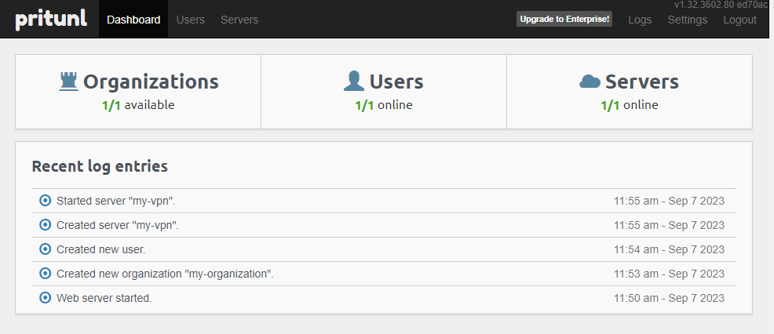

# Pritunl Zero CI/CD pipeline

Deploy Pritunl Zero server with CI/CD on Elestio

 
 

# Once deployed ...

You can open Pritunl Zero ADMIN UI here:

    URL: https://[CI_CD_DOMAIN]
    email: [ADMIN_EMAIL]
    password: [ADMIN_PASSWORD]

You can also connect to mongodb through mongo-express Web UI:

    https://[CI_CD_DOMAIN]:6443/
    Login: admin
    Password: [ADMIN_PASSWORD]
