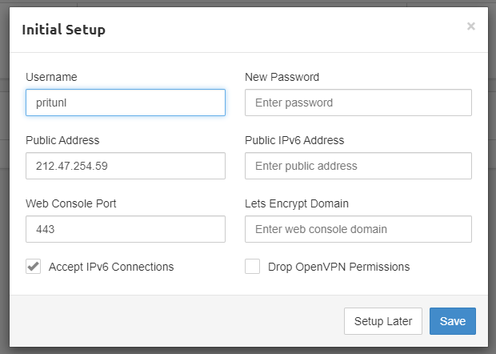
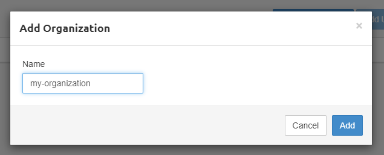
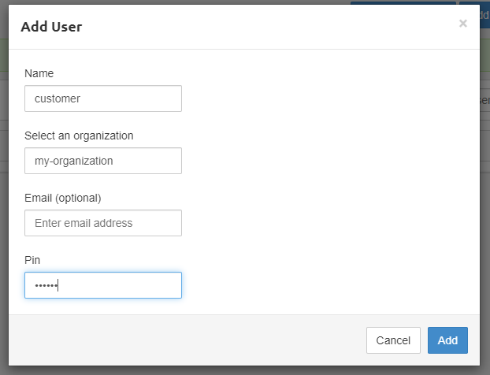
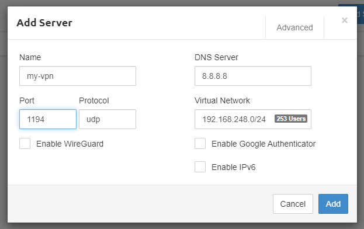
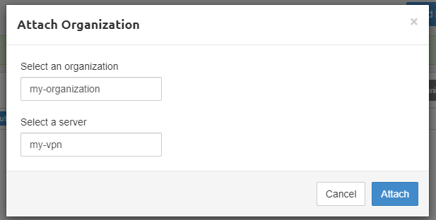
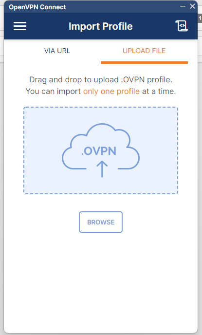
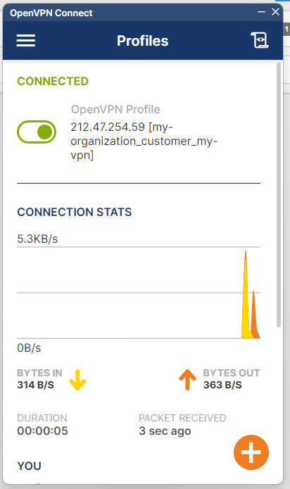

# Pritunl CI/CD pipeline

Deploy Pritunl server with CI/CD on Elestio

 
 

# Once deployed ...

You can open Pritunl ADMIN UI here:

    URL: https://[CI_CD_DOMAIN]
    email: pritunl
    password: [ADMIN_PASSWORD]

# Quick start

1. After logging in with your credentials, you will have a popup that will appear, click on save without touching anything.

   

2. Before you begin, go to the `Users tab` and click on `Add Organization`.
   A popup will open, put the name of your organization and click on `Add`.

   

3. Click on `Add User`.
   A popup will open, put the name of the user, choose a 6-length digit for the pin and click on `Add`.

   

4. Go to the `Servers tab` and click on `Add server`.
   A popup will open, put the name of the server, make sure that Port value is `1194`, then click on `Add`.

   

5. Click on `Attach Organization`.
   A popup will open, choose the organization to connect to the server, click on `Attach`, then click on `Start server`.

   

6. Now you will have to download the user file to be able to connect to the server.
   Before doing this, you will need to download two software.

- 7zip to extract the customer file, <a href="https://www.7-zip.org/" target="_blank">Download here</a>
- OpenVPN to connect to your VPN, <a href="https://openvpn.net/client/" target="_blank">Download here</a>

7. Once installed, go back to the `Users tab`, and next to the user status, you have some icons, click on the `arrow icon`.

   

8. Extract the `.tar` file, launch OpenVPN, and click to the `UPLOAD FILE tab`. Browse your file and open it.

   

9. Enter your credentials, then click on `CONNECT`.
   Now you are connected to your VPN.

   
